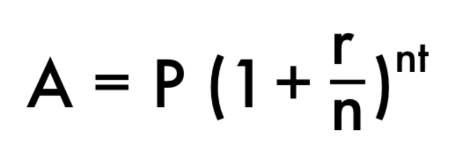

# COMPOUND INTEREST

## ЗАДАНИЕ
Напишите функцию "compoundInterest", которая принимает:
- startDeposit - начальная сумма вложений.
- annualRate - годовая ставка (%).
- annualAmount - кол-во периодов начисления ставки (в год).
- interestPeriod - срок вклада (в годах).
- Полученный результат округлить с помощью библиотеки "cmath".

- Используйте библиотеку "cmath" для возведения в степень.
- Файл для выполнения задания: index.cpp.
- Не использовать стандартное пространство имён (using namespace std).

## ПРИМЕЧАНИЯ
- Аргументы функций работают как переменные, их значение присваивается при вызове функции.
- Как узнать, чётное ли число с помощью оператора "Остаток от деления"?

## СПРАВКА
- Формула сложного процента: 
- A - ожидаемый результат работы функции
- P - startDeposit
- r - annualRate
- n - annualAmount
- t - interestPeriod
- Шпаргалка cmath: https://cplusplus.com/reference/cmath/
- Как подключить и использовать cmath? https://www.youtube.com/watch?v=8lFFsRSs938